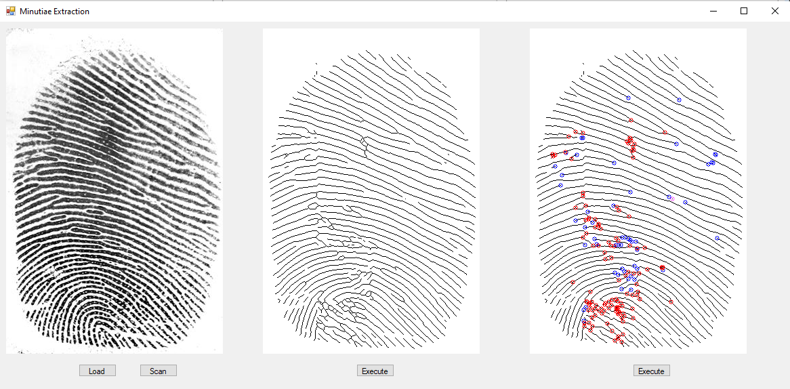

# MinutiaeExtraction

<h2> How to use? </h2>

 Either load 320x480 image (.png, .jpg or .jpeg extensions) or scan fingerprint using Futronic FS88 fingerprint scanner. Afterwards click proper buttons to execute consecutive steps (1. picture loading or scanning, 2.AHE normalization, Gabor filtering, Otsu normalization, thinning, 3.Minutia extraction, false minutiae removal). All steps are described more precisely below.

<h2>Minutiae extraction steps</h2>
<ol>
  <li> Load image </li>
  <li> AHE normalization </li>
  <li> Gabor filtering - on each 80x80 pixels blocks, tests have shown best results, tested on 320x480 pixels images </li>
  <li> Otsu binariztion - each of Gabor filtered blocks is then binarized </li>
  <li> Line thinning - using KMM algorithm </li>
  <li> Minutiae extraction - Crossing Number Concept algorithm </li>
  <li> False minutiae removal - all minutiae on the borders are removed. Needs little improvement - algorithm is not always detecting proper outer ROI border. </li>  
</ol>

Extraction params are saved in the "Extracted Params" directory. If you wish try app on sample fingerprints, some of them are in the "Sample Fingerprints" directory.    
Ridge endings are marked blue, bifurcations are marked red, crossings are marked green, single points are marked pink.

<h2> Overview </h2>

  

